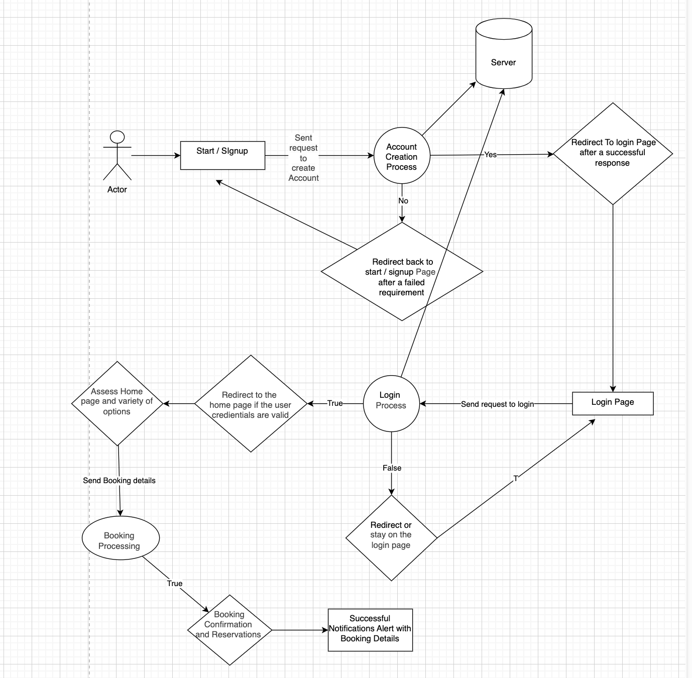

#What is Requirement Analysis?

Requirement Analysis is a critical phase in the software development lifecycle (SDLC) where the project team gathers, analyzes, and defines the requirements of the software product to be developed. This process ensures that all stakeholders have a clear and mutual understanding of what the system should do and how it should perform.

It is important due to the following reasons:
Requirement Analysis is crucial in the SDLC because it lays the foundation for all subsequent development, significantly reducing rework and costs by identifying issues early. It ensures all stakeholders are aligned on project goals, proactively mitigates risks, and provides the clear, testable criteria necessary for quality assurance. Ultimately, a thorough requirement analysis drives successful project delivery by ensuring the software meets user needs and business objectives efficiently.

Why is Requirement Analysis Important?
Clarity and Understanding: It helps in understanding what the stakeholders expect from the software, reducing ambiguity.
Scope Definition: Clearly defines the scope of the project, which helps in preventing scope creep.
Basis for Design and Development: Provides a solid foundation for designing and developing the system.
Cost and Time Estimation: Facilitates accurate estimation of project cost, resources, and time.
Quality Assurance: Ensures that the final product meets the specified requirements, leading to higher customer satisfaction.

Key Activities in Requirement Analysis.
-- Requirement Gathering: This is the initial stage where information about the system's needs and constraints is collected from various stakeholders (users, customers, business owners, etc.). 
-- Requirement Elicitation --- Brainstorming: Conducting brainstorming sessions to generate ideas and gather requirements.
-- Requirement Documentation: Once requirements are gathered, they need to be formally recorded in a clear, concise, and unambiguous manner. This typically involves creating documents like a Software Requirements Specification (SRS), Business Requirements Document (BRD), use cases, user stories, or other models. 
-- Requirement Analysis and Modeling: In this phase, the documented requirements are thoroughly examined for completeness, consistency, clarity, and feasibility. Any ambiguities, conflicts, or missing information are identified and resolved.
-- Requirement Validation: This critical activity ensures that the defined requirements accurately reflect the real needs and expectations of the stakeholders and that they are achievable. 

Types of Requirements.
    Functional Requirement: Functional requirements define what the system should do. They describe the specific behaviors or functions of the system, how it should react to particular inputs, and how it should behave in particular situations. They are typically expressed as actions the system performs.
    Examples---- User Registration and Login: The system shall allow new users to register an account by providing an email address, password, and personal details.

   Non-functional requirements :(NFRs) define how well the system performs a function. They specify criteria that can be used to judge the operation of a system, rather than specific behaviors.
   examples--- Performance:The system shall load search results for available slots within 2 seconds for up to 100 concurrent users.

airbnb-clone-project
This project is a full-stack clone of the popular accommodation booking platform AirBnB. The goal is to build a functional web application that allows users to browse property listings, view detailed property information, and complete bookings. The project will cover frontend development, backend APIs, database design, and deployment.

UI/UX Design Planning

Design Goals Create intuitive booking flow Maintain visual consistency Ensure fast loading times Prioritize mobile responsiveness

Key Features Property search and filtering Detailed property viewing Secure checkout process User authentication

Color Styles:

Primary: #FF5A5F Secondary: #008489 Background: #FFFFFF Text: #222222 Secondary Text: #717171 Typography:

Primary Font: Circular, Medium (500), 16px Headings: Circular, Bold (700), 24px-32px Secondary Text: Circular, Book (400), 14px

Project Roles and Responsibilities

Role Responsibilities Project Manager Oversees timeline, coordinates team, manages deliverables. Frontend Developers Implements UI components, ensures responsive design. Backend Developers Builds APIs, manages database, implements business logic. Designers Creates mockups, maintains design system, ensures UX quality. QA/Testers Writes test cases, performs testing, reports bugs. DevOps Engineers Manages deployment, CI/CD pipeline, server infrastructure. Product Owner Defines requirements, prioritizes features, represents stakeholders. Scrum Master Facilitates agile processes, removes blockers, organizes meetings.

UI Component Patterns Planned Components Navbar

Logo Search bar User navigation Responsive menu Property Card

Property image Basic details (price, location, rating) Favorite button Responsive layout Footer

Site links Company information Social media links Copyright information

Each component will be designed for reusability and consistency across the application.

Use Case Diagrams. Use Case Diagrams are a powerful tool in software engineering for understanding and representing the functionality of a system from the user's perspective. They are part of the Unified Modeling Language (UML), a standardized general-purpose modeling language in the field of software engineering. Some Benefits of Use Case diagrams are: Clear Communication: They provide a high-level, easily understandable overview of system functionality, facilitating communication between stakeholders (developers, clients, users, project managers) who may not have a technical background. Requirements Elicitation and Validation: They help in identifying, clarifying, and validating system requirements by focusing on what the system does for its users. This can uncover missing requirements or discrepancies early in the development cycle.

Below is an image or visual of the Booking system usimg Draw.io

Acceptance Criteria.
Acceptance Criteria are a vital part of Requirement Analysis because they define clear, testable conditions that a software product or feature must meet to be accepted by the client or stakeholders. They help ensure that everyone — including developers, testers, and clients — has the same understanding of the feature requirements.
Example of acceptance criteria: User Story:
As a user, I want to checkout my booking so that I can confirm and pay for my reserved slot.

1. The user must be able to review booking details before checkout.
2. The system should display a summary of the total cost, including taxes and fees.
3. The checkout page must offer payment options (e.g., credit card, PayPal).
4. The system must validate payment information before submission.
5. After successful payment, the user must receive a booking confirmation message and email.
6. The system must update the booking status to “confirmed” in the database.
7. If payment fails, the user should see an appropriate error message and retry option.

    

